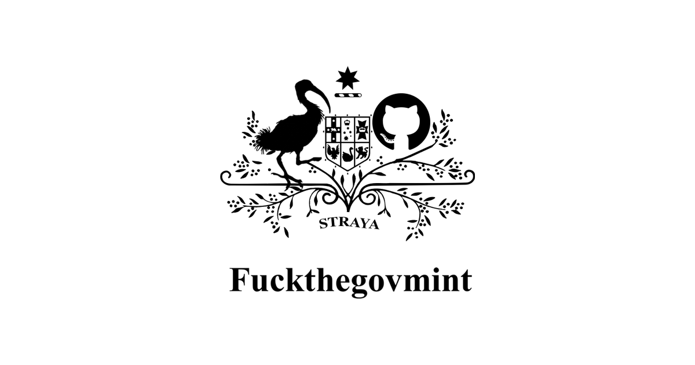

# 去他妈的政府

 

你听到了我的声音。 去他妈的。 去他妈的。

### 语言环境 Languages

> 简体中文 Simplified Chinese 

我不想透露我的健康状况，但我希望支持您的业务。 如果这对您有用，只需说谢谢。 

> 英语 English 

I don't want to disclose my health status, but I wish to support your business. If that works for you simply say Thank you.

> 西班牙语 Spanish 

No quiero revelar mi estado de salud, pero deseo apoyar su negocio. Si eso funciona para usted, simplemente diga Gracias.

> 法语 French 

Je ne veux pas divulguer mon état de santé, mais je souhaite soutenir votre entreprise. Si cela fonctionne pour vous, dites simplement merci.

> 德语 German 

Ich möchte meinen Gesundheitszustand nicht preisgeben, aber ich möchte Ihr Geschäft unterstützen. Wenn das für Sie funktioniert, sagen Sie einfach Danke.

> 俄语 Russian 

Я не хочу раскрывать свое состояние здоровья, но хочу поддержать ваш бизнес. Если это сработает для вас, просто скажите "Спасибо".

> 葡萄牙语 Portuguese 

Não quero divulgar meu estado de saúde, mas gostaria de apoiar seu negócio. Se isso funcionar para você, simplesmente diga Obrigado.

### 资源 Resources

[listingslab CDN](https://listingslab.com/public/)

- [flag SVGs](https://listingslab.com/public/?dir=svg%2Fflags)
- [Google](https://www.google.com/search?q=fuckthegovmint&oq=fuckthegovmint)
